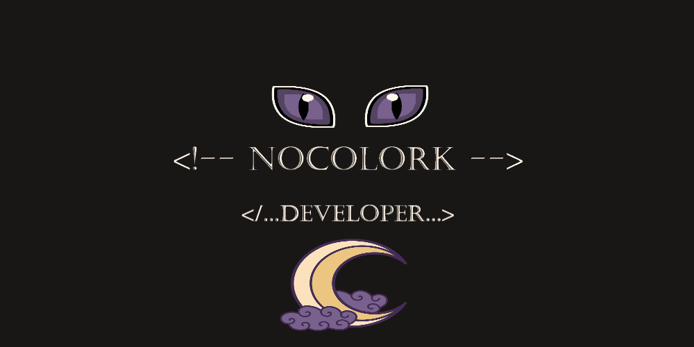

# My_GitPage

# InColork

<html>

  <a href="https://github.com/NoColorK">
    
    </img>

  

   
   
   
   
   
    

<h4 align="center">

More... 

<h1 align="center">Hi my name is João Vitor Brehmer</h1></img>

<h3 align="center">Some add-ons...</h3>

<h4 align="left"><strong>A little about myself...</strong></h4>

 
  I love Design and Programming since I was a kid. I'm studying at DevClub, where I'm always looking to learn more and more, and improve my skills, I'm very hardworking, I learn fast and I'm very calm. I love cold ❄️...

  

  📫 Languages: <strong>English(Basic).</strong>

  💼 Tools: <strong>Figma, Git, Github, HTML5, CSS, JavaScript.</strong>

  🦄 <strong>My work page on github.  ⤵️</strong>

 

  <a href="https://github.com/NoColork?tab=repositories">
    
    </img>
  </a>

  

  💌 Social networks, Contact me... ⤵️

<h3 align="center">About me:</h3>

  
   

<h5 align="center">E-mail</h5>

  
</html>
